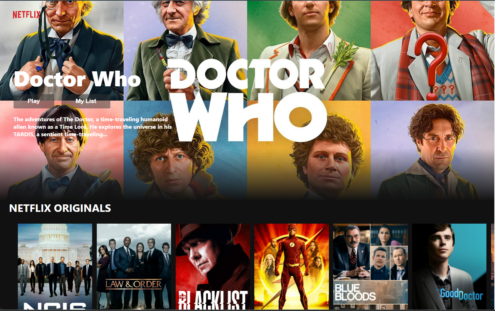
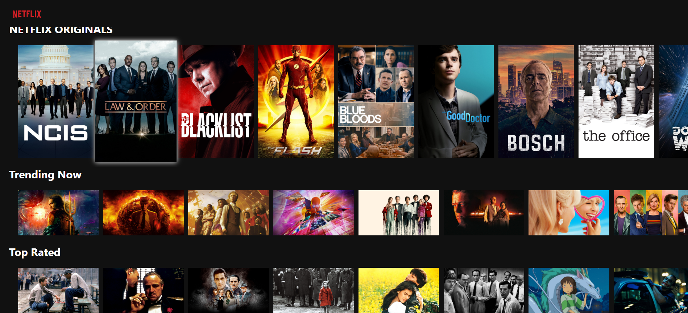
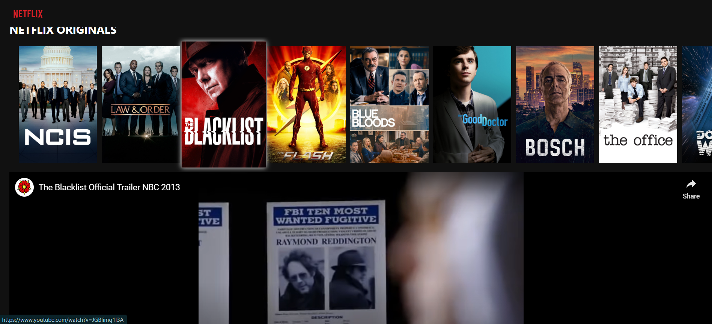

# Netflix Clone

This is a Netflix clone project built with React. Leveraging React's declarative components and state management, the project ensures a dynamic and responsive user interface.

Integrating with TMDB and YouTube APIs, our clone dynamically fetches trending content, top-rated movies, and even trailers, providing users with an engaging visual feast.

The app allows users to browse and watch trailers, and it has been deployed on Firebase. You can visit the live app [here](https://netflix-clone-58504.web.app/).

# Screenshots

&nbsp;

## Getting Started

To run this project locally, follow these steps:

1. Clone the repository
2. Install dependencies: `npm install`
3. Set up API keys
4. Start the development server: `npm start`

## Technologies Used

- React
- Firebase
- TMDB API
- YouTube API

## Live Demo

Check out the live demo [here](https://netflix-clone-58504.web.app/).

## Acknowledgments

- This project was created as part of a learning experience.

Feel free to contribute or raise issues!
